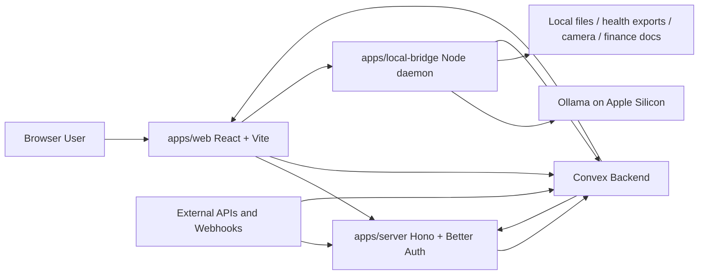

# LifeOS Technical Architecture

Status: Recommended baseline

Date: 2026-03-23

Owner: Shaun Berkley

## 1. Executive Summary

LifeOS should be built as a split system:

- A typed, real-time, self-hostable cloud app for shared state, sync-safe knowledge, automations, and collaboration.
- A mandatory local bridge on Apple Silicon for restricted data processing, local connectors, embeddings, vision, and Ollama inference.

This is the correct architecture because the product wants three things that fight each other:

- Real-time sync and cross-device UX
- Strong privacy for health, finance, and camera data
- A codebase that AI coding tools can reliably extend without turning into a pile of generic abstractions

The winning move is not "make everything local" and it is not "send everything to the cloud." The winning move is a hard privacy boundary:

- Convex is the system of record for sync-safe application state.
- The local bridge is the system of record for restricted raw data.
- Only sanitized, classified, policy-approved derivatives cross from local to cloud.

The rest of the design follows from that.

## 2. Non-Negotiable Decisions

These are not optional.

- Use a TypeScript monorepo with `pnpm` and `turbo`.
- Use Convex as the application backend and event workflow engine.
- Use a React 19 web app built with Vite 7, not Next.js.
- Use a small Hono server for auth, static asset hosting, and non-Convex edge endpoints.
- Use Better Auth as the identity authority, with JWTs for Convex.
- Use a local bridge daemon for all restricted-data connectors and all Ollama calls that touch restricted data.
- Use explicit domain tables, not a generic `items` or `entities` mega-table.
- Use append-only ingest events plus deterministic projectors for integrations.
- Use Convex Workflows and Workpool for durable background jobs.
- Use Ollama structured outputs plus Zod validation for every AI response that drives logic.
- Expose LifeOS as an MCP-capable surface after the core API stabilizes, but use MCP internally for developer tooling immediately.

Bad ideas to reject now:

- Do not use Next.js server components on top of Convex. That is redundant complexity.
- Do not let agents write directly into user-facing tables.
- Do not put health, finance, or camera raw payloads into Convex in plaintext.
- Do not build a generic "one agent does everything" architecture.
- Do not model the whole product as one vector database with a chat UI attached.

## 3. Product Assumptions

This document assumes LifeOS is a personal AI life-management platform with these classes of data:

- Calendar and scheduling
- Tasks and projects
- Notes, documents, links, and inbox capture
- Contacts, places, routines, and habits
- Health signals
- Finance signals
- Camera and vision-derived observations
- Automations, reminders, and assistant actions

It also assumes:

- Solo developer
- 100% of authored code generated or edited through AI coding tools
- Open source under AGPL with high scrutiny
- Self-hosting must be first-class, not an afterthought

## 4. Architecture Principles

1. The source of truth must be typed.

LifeOS is not a "prompt-first" product. Prompts are behavior. Typed state is the product.

2. Restricted data stays local by default.

The burden of proof is on any feature that wants to move raw health, finance, or camera data off device.

3. Integrations are append-only at ingress.

Provider payloads are never mutated in place. They are received, classified, hashed, stored, and projected.

4. Agents propose; workflows execute; policies approve.

The LLM decides less than most AI apps think it should.

5. The codebase must be easy for AI tools to navigate.

That means shallow module boundaries, small files, deterministic patterns, and a ruthless ban on cute abstractions.

6. RAG is a secondary retrieval layer, not the primary data model.

Structured data first. Semantic retrieval second.

## 5. System Topology



### Responsibility split

- `apps/web`
  - Product UI
  - Convex subscriptions
  - Local-bridge discovery and pairing
  - Drafting and approval flows

- `apps/server`
  - Better Auth
  - Static asset hosting in self-hosted mode
  - OAuth callbacks
  - MCP and token endpoints
  - Public webhooks that should not hit Convex directly

- `convex/`
  - Realtime application state
  - Domain mutations and queries
  - Workflow orchestration
  - Integration event queueing and projection
  - Sync-safe memory and search indexes

- `apps/local-bridge`
  - Restricted connectors
  - Local OCR, vision, embeddings, summarization
  - Data redaction and policy enforcement
  - Signed envelope delivery to Convex

## 6. Opinionated Stack

| Area | Choice | Why |
| --- | --- | --- |
| Runtime | Node.js 24 Active LTS | Current production-safe baseline as of March 2026 |
| Language | TypeScript 5.9 strict mode | Mature, fast, and well-supported by AI tools |
| Monorepo | `pnpm` + `turbo` | Fast, deterministic, minimal ceremony |
| Frontend | React 19 + Vite 7 + TanStack Router | Simpler than Next for a Convex-first app |
| State sync | Convex React client | Native real-time subscriptions |
| Edge server | Hono | Small, explicit, easy to self-host |
| Auth | Better Auth + JWT plugin | Self-hostable, TS-native, no SaaS lock-in |
| Backend | Convex + Components + Workflows | Realtime, infra-as-code, durable orchestration |
| Local AI | Ollama JS client | Local-only inference on Apple Silicon |
| Validation | Zod at network boundaries, Convex `v` inside backend | The right split for this stack |
| Styling | Tailwind CSS v4 + Radix primitives + `cva` | Fast iteration without shadcn copy-paste sprawl |
| Lint/format | Biome, plus narrow ESLint for React Hooks and Convex rules | Fast defaults with targeted guardrails |
| Testing | Vitest 4, `convex-test`, Playwright | Fast unit tests plus real browser coverage |
| Observability | Pino + OpenTelemetry + OTLP export | Works in self-hosted and hosted setups |
| Dependency updates | Renovate | Better grouping and policy controls than Dependabot |
| Container security | Syft + Trivy + Cosign | SBOM, scan, sign |

### Why not Next.js

Because Convex already provides the backend model, subscriptions, database, and a lot of the mutation semantics people usually stack Next on top of.

Adding Next.js here would buy you:

- More deployment complexity
- More cache invalidation surface area
- More auth complexity
- More places for AI tools to generate wrong patterns

For LifeOS, Vite plus Hono is the better answer.

## 7. Monorepo Structure

```text
lifeos/
  apps/
    web/
      src/
        app/
        features/
        routes/
        components/
        providers/
        lib/
    server/
      src/
        auth/
        routes/
        middleware/
        mcp/
        config/
    local-bridge/
      src/
        connectors/
        pipelines/
        policies/
        models/
        pairing/
        mcp/
  packages/
    domain/
      src/
        ids.ts
        enums.ts
        schemas/
        policies/
    ui/
      src/
        primitives/
        patterns/
        tokens/
    ai-runtime/
      src/
        model-policy.ts
        structured.ts
        providers/
    integrations/
      src/
        manifest.ts
        envelope.ts
        projectors/
        providers/
    logging/
      src/
    security/
      src/
        crypto/
        redaction/
        signatures/
    config/
      src/
  convex/
    auth.config.ts
    http.ts
    schema.ts
    modules/
      identity/
      integrations/
      tasks/
      calendar/
      notes/
      memory/
      agents/
      workflows/
      audit/
  docs/
    architecture/
    adr/
    runbooks/
    specs/
  tools/
    scripts/
    generators/
  .github/
    workflows/
  AGENTS.md
  CLAUDE.md
  llms.txt
  llms-full.txt
  pnpm-workspace.yaml
  turbo.json
  tsconfig.base.json
```

### Layout rules

- `convex/` stays at the repo root. Do not bury it in a package.
- Domain packages may contain shared types and helpers, but they do not become alternate data layers.
- `apps/local-bridge` is a first-class app, not a script folder.
- `packages/integrations` owns provider contracts. It does not own runtime secrets.

## 8. Type System Rules

Use one strict base config everywhere.

```json
{
  "compilerOptions": {
    "target": "ES2023",
    "module": "ESNext",
    "moduleResolution": "Bundler",
    "strict": true,
    "noUncheckedIndexedAccess": true,
    "exactOptionalPropertyTypes": true,
    "noImplicitOverride": true,
    "useUnknownInCatchVariables": true,
    "noFallthroughCasesInSwitch": true,
    "verbatimModuleSyntax": true,
    "resolveJsonModule": true,
    "allowJs": false
  }
}
```

### Type rules

- No `any` in application code.
- No untyped `JSON.parse`.
- No "stringly typed" IDs across package boundaries.
- No domain enums duplicated in three places.
- Prefer `satisfies` over `as`.
- Prefer discriminated unions over booleans like `isError`.
- Prefer pure functions and modules over classes.

### ID branding

```ts
export type Brand<T, B extends string> = T & { readonly __brand: B };

export type WorkspaceId = Brand<string, "WorkspaceId">;
export type ConnectionId = Brand<string, "ConnectionId">;
export type SourceEventId = Brand<string, "SourceEventId">;
```

Use branded IDs in shared packages and Convex `Id<"...">` inside backend code. Do not leak raw provider IDs into UI state.

## 9. Data Classification Model

This is the most important product rule after authentication.

| Classification | Examples | May leave device? | Storage rule |
| --- | --- | --- | --- |
| `public` | docs, tasks, titles, tags | Yes | Plain in Convex |
| `private` | notes, email excerpts, routine summaries | Yes, if user-enabled | Encrypt at rest if sensitive |
| `restricted` | health raw exports, finance raw statements, camera frames | No by default | Local bridge only, or encrypted blob with local key escrow disabled by default |
| `derived` | summaries, metrics, embeddings, classifications | Yes, if produced under policy | Plain or encrypted depending on downstream use |

### Hard rules

- `restricted` raw payloads never go to remote models.
- `restricted` raw payloads never go to Convex in plaintext.
- The local bridge must label every outbound envelope with a classification.
- Every AI workflow must declare the highest classification it may touch.

### Policy guard

```ts
export type DataClass = "public" | "private" | "restricted" | "derived";
export type ModelClass = "local" | "remote";

export function assertModelAllowed(dataClass: DataClass, modelClass: ModelClass) {
  if (dataClass === "restricted" && modelClass !== "local") {
    throw new Error("Restricted data must stay on local models");
  }
}
```

Every model call in both `apps/local-bridge` and `packages/ai-runtime` goes through this guard first.

## 10. Backend Model in Convex

### Table groups

- Identity
  - `users`
  - `workspaces`
  - `memberships`
  - `devices`

- Integrations
  - `connections`
  - `connectionSecrets`
  - `sourceEvents`
  - `syncCursors`
  - `syncJobs`
  - `deadLetters`

- Core life graph
  - `tasks`
  - `calendarEvents`
  - `notes`
  - `documents`
  - `contacts`
  - `places`
  - `metrics`
  - `transactions`
  - `mediaAssets`

- Knowledge and retrieval
  - `chunks`
  - `chunkEmbeddings`
  - `facts`
  - `memories`
  - `insights`

- Agent and automation state
  - `assistantThreads`
  - `assistantRuns`
  - `draftActions`
  - `toolExecutions`
  - `approvals`
  - `artifacts`

- Security and audit
  - `auditEvents`
  - `policyViolations`

### Schema excerpt

```ts
import { defineSchema, defineTable } from "convex/server";
import { v } from "convex/values";

const EMBEDDING_DIMS = 768 as const;

export default defineSchema({
  workspaces: defineTable({
    slug: v.string(),
    name: v.string(),
    createdBy: v.string(),
  }).index("by_slug", ["slug"]),

  connections: defineTable({
    workspaceId: v.id("workspaces"),
    provider: v.string(),
    mode: v.union(v.literal("cloud"), v.literal("local")),
    dataClass: v.union(
      v.literal("public"),
      v.literal("private"),
      v.literal("restricted"),
      v.literal("derived"),
    ),
    status: v.union(
      v.literal("active"),
      v.literal("paused"),
      v.literal("error"),
    ),
    externalAccountId: v.optional(v.string()),
  }).index("by_workspace", ["workspaceId"]),

  sourceEvents: defineTable({
    workspaceId: v.id("workspaces"),
    connectionId: v.id("connections"),
    idempotencyKey: v.string(),
    eventType: v.string(),
    payloadHash: v.string(),
    payloadRef: v.optional(v.string()),
    receivedAt: v.string(),
    projectionState: v.union(
      v.literal("pending"),
      v.literal("applied"),
      v.literal("dead_letter"),
    ),
  })
    .index("by_connection", ["connectionId", "receivedAt"])
    .index("by_idempotency", ["idempotencyKey"]),

  tasks: defineTable({
    workspaceId: v.id("workspaces"),
    title: v.string(),
    status: v.union(
      v.literal("inbox"),
      v.literal("todo"),
      v.literal("doing"),
      v.literal("done"),
      v.literal("canceled"),
    ),
    sourceEventId: v.optional(v.id("sourceEvents")),
    dueAt: v.optional(v.string()),
    updatedAt: v.string(),
  }).index("by_workspace_status", ["workspaceId", "status"]),

  chunks: defineTable({
    workspaceId: v.id("workspaces"),
    documentKind: v.string(),
    documentId: v.string(),
    text: v.string(),
    metadata: v.any(),
  }).index("by_document", ["documentKind", "documentId"]),

  chunkEmbeddings: defineTable({
    workspaceId: v.id("workspaces"),
    chunkId: v.id("chunks"),
    kind: v.string(),
    model: v.string(),
    vector: v.array(v.float64()),
  }).vectorIndex("by_vector", {
    vectorField: "vector",
    dimensions: EMBEDDING_DIMS,
    filterFields: ["workspaceId", "kind"],
    staged: true,
  }),
});
```

### Why explicit tables instead of a generic graph

Because AI-generated code gets worse as abstraction density rises. A generic graph looks elegant until every feature becomes:

- A JSON blob
- A dozen runtime checks
- Impossible migrations
- Broken autocomplete

Use explicit tables. You are optimizing for long-term correctness, not initial cleverness.

## 11. Convex Usage Patterns

### Queries

Use queries only for:

- reads
- derived view assembly
- authorization checks that are part of reads

Queries stay pure and small.

### Mutations

Use mutations only for:

- transactional writes
- idempotent projection steps
- audit event creation

Mutations do not call external services.

### Actions

Use actions only for:

- network calls
- vector search
- model inference
- file processing that requires Node APIs

### Workflows

Use workflows for:

- multi-step import pipelines
- AI runs with retries
- background repair jobs
- approval-expiry timers
- fan-out and join jobs

### HTTP actions

Use HTTP actions sparingly.

They are correct for:

- signed envelopes from local bridge
- provider webhooks
- narrow public APIs

They are not correct for general frontend traffic.

Convex documents that HTTP actions do not do argument validation for you and are not automatically retried. Treat that as a warning, not a footnote.

### HTTP action pattern

```ts
import { httpRouter } from "convex/server";
import { httpAction } from "./_generated/server";
import { internal } from "./_generated/api";
import { z } from "zod";

const Envelope = z.object({
  workspaceId: z.string(),
  connectionId: z.string(),
  eventId: z.string(),
  eventType: z.string(),
  payloadHash: z.string(),
  payloadRef: z.string().optional(),
  receivedAt: z.string(),
});

function verifySignature(raw: string, signature: string | null, secret: string) {
  if (!signature) throw new Error("missing signature");
  // use timing-safe HMAC compare in packages/security
}

const http = httpRouter();

http.route({
  path: "/ingest/local",
  method: "POST",
  handler: httpAction(async (ctx, request) => {
    const raw = await request.text();
    verifySignature(
      raw,
      request.headers.get("x-lifeos-signature"),
      process.env.LOCAL_BRIDGE_SHARED_SECRET!,
    );

    const envelope = Envelope.parse(JSON.parse(raw));

    await ctx.runMutation(internal.integrations.ingest.acceptEnvelope, envelope);

    return Response.json({ accepted: true }, { status: 202 });
  }),
});

export default http;
```

## 12. Integration Framework

Every integration implements the same pipeline:

1. Fetch or receive provider payload
2. Convert to a canonical envelope
3. Store the envelope immutably with idempotency key
4. Project into typed domain tables
5. Emit audit and sync status events

### Canonical envelope

```ts
import { z } from "zod";

export const CanonicalEnvelope = z.object({
  provider: z.string(),
  connectionId: z.string(),
  idempotencyKey: z.string(),
  occurredAt: z.string(),
  receivedAt: z.string(),
  dataClass: z.enum(["public", "private", "restricted", "derived"]),
  eventType: z.string(),
  payloadRef: z.string().optional(),
  checksum: z.string(),
  projector: z.string(),
});

export type CanonicalEnvelope = z.infer<typeof CanonicalEnvelope>;
```

### Provider manifest contract

```ts
export interface IntegrationManifest {
  provider: string;
  displayName: string;
  mode: "cloud" | "local" | "hybrid";
  syncStrategy: "poll" | "webhook" | "file-watch" | "manual-import";
  defaultDataClass: "public" | "private" | "restricted" | "derived";
  supportsBackfill: boolean;
  makeIdempotencyKey(input: {
    externalId: string;
    version?: string;
    checksum?: string;
  }): string;
}
```

### Projector rule

One integration may project into many tables, but projection is always deterministic from the stored envelope. That gives you replayability, migration safety, and debuggability.

### Connector rules

- Cloud connectors live in Convex actions or Hono routes.
- Local and restricted connectors live in `apps/local-bridge`.
- Hybrid connectors split ingress local, metadata sync cloud.
- Every connector has a contract test suite with recorded fixtures.

## 13. Local Bridge

`apps/local-bridge` is mandatory for LifeOS. Treat it as a product component, not tooling.

### Responsibilities

- Manage restricted connectors
- Access local files, camera frames, exports, and device-specific data
- Run Ollama locally
- Produce structured outputs and embeddings
- Apply redaction and classification policies
- Pair securely with a workspace
- Sign outbound envelopes to Convex
- Expose local-only tools to the web app and AI tools

### Runtime model

- Node 24 service
- Runs as LaunchAgent on macOS
- Stores secrets in macOS Keychain when available
- Maintains an append-only local queue on disk for offline durability

### The bridge owns these workflows

- OCR on uploaded PDFs
- camera frame analysis
- health export normalization
- finance statement parsing
- restricted-data embeddings
- local-only assistant conversations

### Bridge to Convex sync rule

The bridge sends:

- sanitized summaries
- derived metrics
- classifications
- encrypted blob references if the user explicitly enables them

It does not send raw restricted payloads by default.

## 14. AI Runtime Design

Do not scatter model calls across the repo.

All LLM usage goes through `packages/ai-runtime`.

### Model profiles

- `local.reasoning`
- `local.vision`
- `local.embedding`
- `remote.general`
- `remote.fast`

Each profile declares:

- allowed data classes
- context window expectations
- structured output requirements
- timeout
- retry policy

### Structured output wrapper

```ts
import ollama from "ollama";
import { z } from "zod";
import { zodToJsonSchema } from "zod-to-json-schema";

export async function runLocalStructured<TSchema extends z.ZodTypeAny>(input: {
  model: string;
  prompt: string;
  schema: TSchema;
}) {
  const response = await ollama.chat({
    model: input.model,
    messages: [{ role: "user", content: input.prompt }],
    format: zodToJsonSchema(input.schema),
    options: { temperature: 0 },
  });

  return input.schema.parse(JSON.parse(response.message.content));
}
```

This matches the way Ollama documents structured outputs: send a JSON schema and validate the result with Zod. That is the only acceptable way to drive write actions from model output.

### Routing rule

- If `dataClass === "restricted"`, the call must route to local Ollama.
- If the task only needs sync-safe summaries, cloud models may be used.
- Mixed-class tasks must be split into local derivation first, remote reasoning second.

## 15. Retrieval, Memory, and Search

### Hard rule

Do not build one giant vector store.

Instead:

- store chunks by domain
- store embeddings in a separate table
- filter aggressively before semantic search
- use structured lookups before vector lookups

This matches Convex's own recommendation pattern of separate embedding tables when vectors are large.

### Retrieval order

1. Exact structured data
2. Indexed filters
3. Full-text search
4. Vector search
5. Agent reasoning over the merged result

### Memory write path

1. Capture or import source data
2. Normalize into domain records
3. Chunk only the textual surfaces that are worth retrieving later
4. Generate embeddings
5. Extract candidate facts
6. Store facts separately from raw chunks
7. Require explicit review for durable high-impact facts

### Vector search rule

Convex vector search only runs in actions. Keep the pattern explicit.

```ts
export const retrieveChunks = action({
  args: { workspaceId: v.id("workspaces"), queryEmbedding: v.array(v.float64()) },
  handler: async (ctx, args) => {
    const hits = await ctx.vectorSearch("chunkEmbeddings", "by_vector", {
      vector: args.queryEmbedding,
      limit: 12,
      filter: (q) => q.eq("workspaceId", args.workspaceId),
    });

    return ctx.runQuery(internal.memory.fetchChunksByEmbeddingIds, {
      ids: hits.map((hit) => hit._id),
    });
  },
});
```

## 16. Agents, Workflows, and Approvals

LifeOS should not expose raw model autonomy to user data.

Use this control model:

- Assistants generate proposals
- Workflows coordinate durable steps
- Policies decide if human approval is required
- Mutations commit final state

### Agent roles

- Planner
- Summarizer
- Router
- Scheduler
- Local analyst
- Data repair assistant

Do not create a general-purpose super-agent until there is a clear reason.

### Approval triggers

Always require explicit user approval for:

- sending outbound messages
- writing to finance-related records
- writing durable health interpretations
- deleting records
- changing schedules for other people

### Workflow example

```ts
import { v } from "convex/values";
import { WorkflowManager } from "@convex-dev/workflow";
import { components } from "../_generated/api";
import { internal } from "../_generated/api";

const workflow = new WorkflowManager(components.workflow);

export const importAndProjectEvent = workflow.define({
  args: { sourceEventId: v.id("sourceEvents") },
  handler: async (step, { sourceEventId }) => {
    const sourceEvent = await step.runQuery(
      internal.integrations.ingest.getPendingEvent,
      { sourceEventId },
    );
    if (!sourceEvent) return;

    const normalized = await step.runAction(
      internal.integrations.ingest.normalizeEvent,
      { sourceEventId },
      { retry: true },
    );

    await step.runMutation(internal.integrations.ingest.applyProjection, {
      sourceEventId,
      normalized,
    });

    await step.runMutation(internal.integrations.ingest.markApplied, {
      sourceEventId,
    });
  },
});
```

Workflow step rule:

- pass IDs, not large blobs
- make every step idempotent
- write outputs before scheduling follow-up work

## 17. Authentication and Authorization

### Choice

Use Better Auth as the identity provider and session manager. Use its JWT plugin to issue tokens that Convex verifies through a custom JWT provider.

This is the best fit because:

- self-hostable
- TypeScript-native
- no SaaS dependency
- simple enough for a solo maintainer
- strong enough to extend later into OAuth or MCP auth

### Auth shape

- Hono serves Better Auth endpoints
- Better Auth stores auth data in SQLite for self-hosted mode
- Web app uses session cookies for Hono
- Web app requests a short-lived JWT for Convex
- Convex validates JWT via JWKS

### Better Auth config excerpt

```ts
import { betterAuth } from "better-auth";
import { jwt } from "better-auth/plugins";

export const auth = betterAuth({
  plugins: [
    jwt({
      jwks: {
        jwksPath: "/.well-known/jwks.json",
        keyPairConfig: {
          alg: "ES256",
        },
        rotationInterval: 60 * 60 * 24 * 30,
        gracePeriod: 60 * 60 * 24 * 30,
      },
      jwt: {
        issuer: process.env.AUTH_ISSUER!,
        audience: process.env.CONVEX_APPLICATION_ID!,
        expirationTime: "15m",
      },
    }),
  ],
});
```

### Convex auth config excerpt

```ts
import { AuthConfig } from "convex/server";

export default {
  providers: [
    {
      type: "customJwt",
      issuer: process.env.AUTH_ISSUER!,
      applicationID: process.env.CONVEX_APPLICATION_ID!,
      jwks: `${process.env.AUTH_ISSUER!}/.well-known/jwks.json`,
      algorithm: "ES256",
    },
  ],
} satisfies AuthConfig;
```

### Authorization model

Keep RBAC boring:

- `owner`
- `admin`
- `member`
- `service`

Then layer object-level authorization in Convex functions.

### Device auth

The local bridge authenticates as a device-bound public client. Each device gets:

- device record
- revocable token
- audit trail
- pairwise secret for signed envelopes

If you later enable Better Auth's OAuth 2.1 Provider for MCP or third-party clients, follow its documented requirement to disable the plain `/token` endpoint and the automatic JWT response header in that mode.

## 18. Documentation for an AI-First Codebase

This is where most teams underinvest.

### Required top-level docs

- `README.md`
- `llms.txt`
- `llms-full.txt`
- `docs/architecture/lifeos-technical-architecture.md`
- `docs/data-classification.md`
- `docs/runbooks/*.md`

### AI instruction files should be minimal or omitted

Do not treat `AGENTS.md` or `CLAUDE.md` as a second architecture layer.

Always-on context files can make coding agents slower, more expensive, and more biased toward stale or irrelevant patterns. They are only justified when they contain small, repo-specific deltas that the model is unlikely to infer correctly from the codebase.

Good examples:

- hard privacy rules
- destructive-operation bans
- one or two commands the agent consistently forgets
- legacy traps like "this exists but is deprecated"
- "if surprised, report it"

Bad examples:

- package manager summaries
- directory tours
- dependency lists
- framework explanations
- generic TypeScript style rules
- anything already enforced by types, tests, lint, or CI

If you use agent instruction files at all:

- keep them under 15 lines when possible
- keep them tool-agnostic when possible
- prefer one tiny shared file over several drifting ones
- delete rules as models improve
- never let them become the source of truth for architecture

### Feature spec structure

For every meaningful feature:

```text
docs/specs/<feature>/
  spec.md
  acceptance.md
  invariants.md
  prompt-log.md
```

`prompt-log.md` is not fluff. In an AI-written codebase, reproducibility matters.

### ADR discipline

Use Architecture Decision Records from day one:

- one decision per file
- short
- linked from README and feature specs

### Required AI workflow

Every AI coding tool should follow the same operating loop:

1. Read this architecture document for the current system shape.
2. Read `docs/data-classification.md` before touching AI, health, finance, camera, or local-bridge code.
3. Read `convex/schema.ts`, then the relevant module files and nearby tests.
4. If a minimal `AGENTS.md` exists, read it as a delta prompt, not as the source of truth.
5. Prefer test-defined development for behavior changes.
6. Run local validation before proposing completion.
7. Fix failures instead of bypassing checks.

### Context files AI should always read

- `docs/architecture/lifeos-technical-architecture.md`
- `docs/data-classification.md`
- `convex/schema.ts`
- relevant `docs/specs/<feature>/*`
- relevant nearby `*.test.ts` files

If `AGENTS.md` exists, it should be short enough to read in seconds.

### Test-defined development

For important changes, write or update the test first and use it as the implementation contract.

```ts
describe("tasks.create", () => {
  it("creates a task with default values", async () => {
    const id = await ctx.mutation(api.tasks.create, {
      title: "Buy groceries",
      domain: "personal",
    });

    const task = await ctx.query(api.tasks.get, { id });

    expect(task.status).toBe("inbox");
    expect(task.executability).toBe("human_only");
    expect(task.escalationFlagged).toBe(false);
  });

  it("rejects unauthenticated users", async () => {
    await expect(
      unauthCtx.mutation(api.tasks.create, {
        title: "Should fail",
        domain: "work",
      }),
    ).rejects.toThrow("Authentication required");
  });
});
```

This is the preferred prompt shape for AI tools: "Implement `tasks.create` to satisfy the existing tests."

### Minimal agent note template

If you keep an always-on instruction file, it should look more like this than a full repo manual:

```markdown
# LifeOS Agent Notes

- Restricted health, finance, and camera raw data must stay local.
- Do not send restricted data to remote models.
- Do not write model output directly into durable user-facing tables.
- Use append-only ingest plus projectors for integrations.
- Do not target production Convex or production MCP by default.
- Do not run long-lived dev servers unless explicitly asked.
- If the repo structure or behavior seems surprising, report it instead of encoding a new rule.
```

That is usually enough. Put durable knowledge in the architecture doc, specs, tests, lint rules, and codebase. Use `AGENTS.md` only as a narrow steering layer.

## 19. Coding Standards and Guardrails

### File and module limits

- target under 300 lines per file
- target under 200 lines per React component file
- target under 50 lines per function unless complexity is justified
- target at most 3 parameters before switching to an options object
- target at most 3 levels of nesting
- target cyclomatic complexity of 15 or less
- target roughly 15 imports or fewer per file before reconsidering the design
- ban utility dumping grounds like `helpers.ts`

When a file approaches those limits, split by responsibility instead of adding comments and regions to hold it together.

### Import rules

- no cross-feature imports from `apps/web/src/features/*` without public surface files
- no app importing private internals from another app
- no cyclic package dependencies

### API rules

- every external boundary uses Zod
- every Convex function defines `args`
- every write path emits an audit event if user-visible state changes
- every async workflow carries a correlation ID

### AI-specific rules

- no generated code lands without tests
- no generated code lands without a spec link
- no agent edits production env files
- no MCP server may target production by default
- no prompt file may contain secrets
- prefer test-defined development for behavior changes
- prefer nearby tests over prose when both exist

### Repo-local MCP configuration

Use MCP for development, but keep it fenced:

```json
{
  "mcpServers": {
    "convex": {
      "command": "npx",
      "args": ["convex", "mcp", "start", "--project-dir", "."]
    },
    "lifeos-local": {
      "command": "pnpm",
      "args": ["--filter", "@lifeos/local-bridge", "mcp"]
    }
  }
}
```

Do not add Convex production flags here. Convex's own MCP server requires an explicit dangerous flag for production access. Keep it that way.

## 20. Error Handling

### Standard error shape

```ts
export type AppErrorCode =
  | "UNAUTHORIZED"
  | "FORBIDDEN"
  | "INVALID_INPUT"
  | "POLICY_VIOLATION"
  | "CONFLICT"
  | "NOT_FOUND"
  | "EXTERNAL_FAILURE"
  | "RATE_LIMITED";

export interface AppError {
  code: AppErrorCode;
  message: string;
  retryable: boolean;
  details?: Record<string, unknown>;
  correlationId: string;
}
```

### Rules

- never throw bare strings
- never swallow errors
- never log secrets
- map provider errors into internal error codes immediately
- send failed projections to `deadLetters`, not to the void

### Dead-letter pattern

- store the failed envelope ID
- store classifier and projector names
- store retry count
- store last error code and redacted message
- expose a repair UI in admin settings

## 21. Observability

Use open standards.

### Logging

- Pino JSON logs everywhere
- include `correlationId`, `workspaceId`, `connectionId`, `runId`, `deviceId`

### Tracing

- OpenTelemetry in `apps/web`, `apps/server`, and `apps/local-bridge`
- OTLP exporter
- default self-host target: Grafana LGTM stack

### Metrics that actually matter

- sync lag by connector
- dead-letter count by provider
- workflow retry count
- approval latency
- local bridge online/offline status
- AI token and latency cost per model profile
- vector index freshness

## 22. Testing Strategy

Testing is where AI-generated codebases either become serious or become embarrassing.

### Test pyramid

- Unit tests
  - pure functions
  - mappers
  - policy logic
  - prompt builders

- Convex function tests
  - use `convex-test`
  - mutation invariants
  - auth rules
  - projector idempotency

- Integration tests
  - Hono auth flows
  - local bridge to Convex signed envelope flow
  - connector fixtures

- E2E tests
  - Playwright
  - browser plus mocked local bridge
  - browser plus real local bridge in nightly runs

- Evaluation tests
  - structured output validity
  - tool selection correctness
  - policy refusal correctness
  - regression dataset for sensitive-data routing

### Convex test example

```ts
import { convexTest } from "convex-test";
import { expect, test } from "vitest";
import schema from "../schema";
import { internal } from "../_generated/api";

const modules = import.meta.glob("../**/*.ts");

test("ingest is idempotent", async () => {
  const t = convexTest(schema, modules);

  const { workspaceId, connectionId } = await t.run(async (ctx) => {
    const workspaceId = await ctx.db.insert("workspaces", {
      slug: "personal",
      name: "Personal",
      createdBy: "user_123",
    });

    const connectionId = await ctx.db.insert("connections", {
      workspaceId,
      provider: "local-files",
      mode: "local",
      dataClass: "restricted",
      status: "active",
    });

    return { workspaceId, connectionId };
  });

  const envelope = {
    workspaceId,
    connectionId,
    idempotencyKey: "evt_123",
    eventType: "task.created",
    payloadHash: "abc",
    receivedAt: new Date().toISOString(),
  };

  await t.mutation(internal.integrations.ingest.acceptEnvelope, envelope);
  await t.mutation(internal.integrations.ingest.acceptEnvelope, envelope);

  const rows = await t.query(internal.integrations.ingest.countByIdempotencyKey, {
    idempotencyKey: "evt_123",
  });

  expect(rows).toBe(1);
});
```

### AI evaluation suite

Create `packages/evals` immediately.

It should contain:

- golden prompts
- input fixtures
- expected schema outputs
- expected allow or deny policy results
- prompt versions

Run a fast eval subset on every PR and the full suite nightly.

## 23. CI/CD and Supply Chain

### Branch strategy

Use trunk-based development:

- protected `main`
- short-lived feature branches
- squash merge only
- no direct pushes to `main`

### Branch naming

Use explicit prefixes:

- `feat/task-priority-scoring`
- `fix/memory-recall-auth`
- `refactor/split-ingest-projector`
- `docs/adr-auth-boundary`

### Commit conventions

Use conventional commits:

- `feat(tasks): add priority scoring with RICE formula`
- `fix(memory): move vector retrieval into action`
- `refactor(integrations): split ingest from projection`
- `test(local-bridge): add signed envelope replay cases`
- `docs: add ADR for auth boundary`
- `chore: update Convex and regenerate types`

Rules:

- one logical change per commit
- squash merge to preserve a clean trunk
- no commit with failing required checks

### Required GitHub checks

- format
- lint
- typecheck
- unit tests
- Convex tests
- Playwright smoke
- build
- dependency review
- CodeQL
- secrets scan
- SBOM generation
- container scan

### Supply-chain controls

- GitHub dependency review on PRs
- GitHub push protection for secrets
- CodeQL on default branch
- Syft SBOM for every container build
- Trivy for image scanning
- Cosign signatures and attestations
- SLSA provenance for release artifacts
- OpenSSF Scorecard nightly

### Release pipeline

1. Merge to `main`
2. Build and test
3. Generate SBOM
4. Scan image
5. Sign image
6. Publish GitHub Release
7. Publish Docker images
8. Publish static docs

### Self-hosted deployment target

Support one official self-hosted path first:

- `docker compose up`
- Caddy or Traefik for TLS and reverse proxy
- Hono server container
- web static assets served by Hono or proxy
- Convex self-host deployment using official guide
- persistent volumes for auth SQLite, bridge queue, logs

Do not support five deployment modes out of the gate.

## 24. Security Model

### Secrets

- Bridge secrets live in Keychain when available
- Server secrets live in env vars
- No secrets committed to repo
- No secrets in prompt logs

### Encryption

- Encrypt sensitive blobs before upload
- Keep encryption helpers in `packages/security`
- Rotate key IDs, do not rotate in place silently

### Audit

Audit these actions:

- login
- device pairing
- integration connection changes
- approval grants and denials
- destructive writes
- policy violations

### Privacy review trigger

Any feature that touches:

- health
- finance
- camera
- microphone
- location

must ship with:

- written data-class decision
- policy tests
- threat model note

## 25. Open Source and AGPL Hygiene

Do not treat licensing as legal cleanup for later.

### Required practices

- SPDX license identifier in root files and templates where appropriate
- `LICENSE`
- `NOTICE` if needed
- `CONTRIBUTING.md`
- `SECURITY.md`
- `CODE_OF_CONDUCT.md`

### Strong recommendation

Adopt REUSE compliance early and run `reuse lint` in CI. For an AGPL project that expects scrutiny, this saves pain later.

## 26. What You Are Probably Not Thinking About

### 1. Prompt reproducibility is now architecture

If AI tools write the code, prompt drift becomes an engineering risk. Store prompt logs for major features.

### 2. MCP is not just for product features

Use MCP internally for developer ergonomics:

- Convex MCP
- local bridge MCP
- Playwright MCP

This makes Claude Code, Codex, and Cursor materially more reliable in the repo.

### 3. Policy testing matters as much as unit testing

A wrong privacy route is worse than a wrong CSS class. Build regression tests for "restricted data never routes to remote models."

### 4. One giant ontology is a trap

LifeOS will naturally tempt you into making an over-general knowledge graph. Resist it. Add a new explicit table when a concept becomes real.

### 5. AI-written code needs smaller files than human-written code

Humans tolerate big files better than agents do. Optimize the repo for machine navigation.

### 6. Reviewability is a first-class feature

Every agent write should be easy to trace back to:

- source event
- workflow run
- tool execution
- approval decision

If you cannot explain why a row exists, the system is already decaying.

## 27. Recommended Build Order

Build in this order.

1. Monorepo scaffolding, strict TS config, Biome, Vitest, Playwright, GitHub Actions
2. Hono server plus Better Auth plus Convex JWT auth
3. Core Convex schema for workspaces, memberships, connections, source events, tasks, notes
4. Local bridge shell with pairing, policy guard, Ollama structured output wrapper
5. Signed envelope ingest path from bridge to Convex
6. Deterministic projector framework and dead-letter handling
7. Retrieval pipeline with chunk and embedding tables
8. Assistant threads, draft actions, approvals, and workflows
9. First two integrations only: one cloud, one restricted local
10. MCP surface and external tool exposure after the core API is stable

## 28. Final Recommendation

If you follow one principle above all others, follow this one:

Build LifeOS as a typed event-and-projection platform with a hard local privacy boundary.

That gives you:

- a codebase AI tools can actually maintain
- an architecture open-source reviewers can trust
- a privacy model that is real, not marketing
- a backend that fits Convex instead of fighting it

Anything more abstract than that is premature.

## 29. Source Notes

Current decisions above were checked against the following official sources on March 23, 2026:

- Convex self-hosting: https://docs.convex.dev/self-hosting
- Convex components: https://docs.convex.dev/components
- Convex HTTP actions: https://docs.convex.dev/functions/http-actions
- Convex workflows: https://docs.convex.dev/agents/workflows
- Convex vector search: https://docs.convex.dev/search/vector-search
- Convex testing: https://docs.convex.dev/testing and https://docs.convex.dev/testing/convex-test
- Convex MCP server: https://docs.convex.dev/ai/convex-mcp-server
- Convex auth and custom JWT docs: https://docs.convex.dev/auth/convex-auth and https://docs.convex.dev/auth/advanced/custom-jwt
- Better Auth JWT plugin: https://better-auth.com/docs/plugins/jwt
- Better Auth OAuth provider plugin: https://better-auth.com/docs/plugins/oauth-provider
- Ollama structured outputs: https://docs.ollama.com/capabilities/structured-outputs
- Ollama embeddings: https://docs.ollama.com/capabilities/embeddings
- Ollama cloud and local-only mode: https://docs.ollama.com/cloud
- Node.js release status: https://nodejs.org/en/about/previous-releases
- GitHub dependency review: https://docs.github.com/en/code-security/concepts/supply-chain-security/about-dependency-review
- GitHub push protection: https://docs.github.com/en/code-security/concepts/secret-security/about-push-protection
- SLSA provenance: https://slsa.dev/
